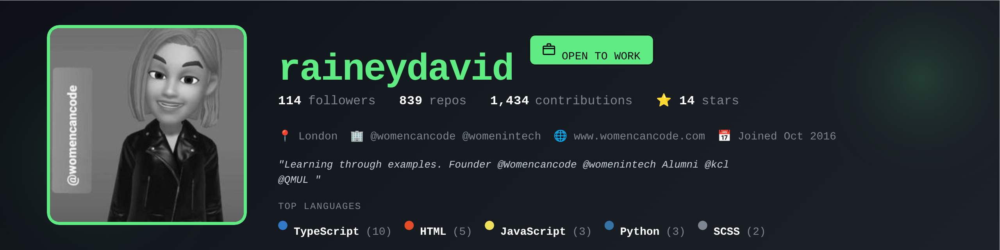

### Hi there 👋

- 💃 I’m currently working on advancing people in tech / education
- 💰 If I provide value for you or you want to help pay it forward, pay me or sponsor me.
- 🎯 I run bespoke training for Individuals, Women and Black in Education
- 🎓 I'm a University Lecturer
- 🌱 I build AI Assisted tools on AWS, Azure, Google Cloud and Open Source 
- 👯 I’m looking to collaborate on AI, ML, DS and Web3
- 💬 Ask me about getting into tech, learning in public, salary negotiation, data science, career advancement
- 😄 Pronouns: she/her

### 📬 Get in touch

<!--
**raineydavid/raineydavid** is a ✨ _special_ ✨ repository because its `README.md` (this file) appears on your GitHub profile.

Here are some ideas to get you started:

- 🔭 I’m currently working on ...
- 🌱 I’m currently learning ...
- 👯 I’m looking to collaborate on ...
- 🤔 I’m looking for help with ...
- 💬 Ask me about ...
- 📫 How to reach me: ...
- 😄 Pronouns: ...
- ⚡ Fun fact: ...
-->
